# Healthcare OLTP to OLAP on Google Cloud Platform (GCP)

This is a complete, working walkthrough of how I built an end-to-end data pipeline on `Google Cloud Platform (GCP)`. It starts with a tiny operational database, generates data into it on a schedule, replicates to BigQuery, transforms into a star schema, and adds basic monitoring. I used the following tools mainly: `Python`, `SQL`, `FastAPI`, `Cloud Run`, `Cloud Scheduler`, `Dataflow`, and `BigQuery`. I wrote it as a step-by-step guide of what I did, where I faced any blocker, and exactly how I fixed it.

## Repo layout:

```bash
├── fastapi-ingest/
│   ├── _endpoint.py  # FastAPI service that inserts vitals into Postgres
│   ├── requirements.txt
│   └── Dockerfile
├── sql/
│   ├── postgres_ddl.sql
│   ├── bq_fact_vitals.sql
│   ├── bq_dim_time.sql
│   ├── bq_dim_patient.sql
│   ├── bq_dim_code.sql
│   ├── bq_dim_unit.sql
│   ├── bq_dim_source.sql
│   └── bq_fact_vitals_star.sql
├── scheduler/
│   └── dataflow_flex_body.json  # JSON body for Scheduler --> Dataflow launching
├── monitoring/
│   ├── scheduler_executions_results_vw.sql
│   ├── scheduler_executions_last_status_vw.sql
│   ├── scheduler_executions_daily_summary_vw.sql
│   ├── scheduler_executions_7d_summary_vw.sql
│   └── scheduler_executions_errors_vw.sql
└── README.md
```

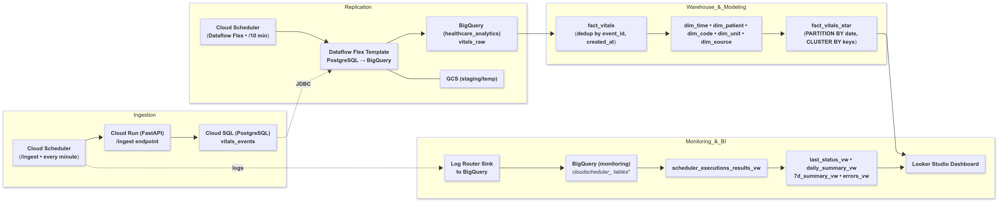


This is a small system on purpose. It does some of the main ideas:
- Generate OLTP data
- Batch-replicate to OLAP with safe overlap
- Transform into a star model
- Partition and cluster for price and speed
- Keep an eye on freshness

## Why I picked these tools and patterns:

- Apart from Python and Bash throughout the project on GCP, for the web part I used FastAPI.
- For the compute container I used Cloud Run because it hides servers and just runs my container on demand.
- For scheduling I used Cloud Scheduler because it gives me a CRON and a run history page without extra paramterization.
- For the OLTP to OLAP copy I used the **Dataflow Flex Template: PostgreSQL_to_BigQuery**. I had the option to use Datastream, DMS, or just simply my own custom code, but I wanted something that is easy to trigger on a cadence with a SQL window, and the Dataflow Flex template is good enough for this project.
- For the warehouse I used BigQuery. I modeled a small star schema just to demonstrate my dimensional thinking, all the while it gives me partitioning and clustering for performance. I deliberately kept the raw JSON as a string since strict JSON parsing is fragile and not needed for the questions I want to answer.


## Prerequisites:

First thing I had to do in a fresh project is to enable the services I know I will touch throughout. I set my project-id as: `healthcare-oltp-olap`.

```bash
gcloud services enable \
  sqladmin.googleapis.com \
  run.googleapis.com \
  cloudscheduler.googleapis.com \
  bigquery.googleapis.com \
  dataflow.googleapis.com \
  artifactregistry.googleapis.com \
  pubsub.googleapis.com \
  compute.googleapis.com \
  storage.googleapis.com
```

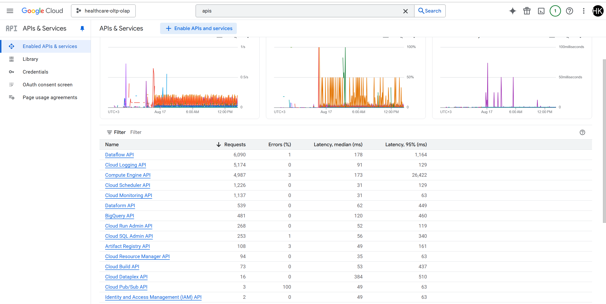


## OLTP in Cloud SQL (PostgreSQL):

### Cloud SQL Instance:

I set up the operational database in the Console so everything would be clear and visible. From the main navigation in GCP I went to SQL --> Create instance --> PostgreSQL and filled in the basics:

- **Instance ID:** `oltp-postgres`
- **Version:** `PostgreSQL 17`
- **Region:** `us-central1 (Iowa)`
- **Default user password (postgres):** `********`

Next I navigated to the **Databases** section in the left naviagation bar and and created a dedicated app database named `my-db`. I also entered the instance and copied the **Instance connection name**(`healthcare-oltp-olap:us-central1:oltp-postgres`) to be used later to mount a Unix socket at `/cloudsql/<connection>` in **Cloud Run**.

The created db can be connected from Cloud Shell using:

```bash
gcloud sql instances list
gcloud sql connect oltp-postgres --user=postgres
# password used for this project: ********
```


### OLTP Table:

This can be done both through the GCP Cloud SQL UI, as weell as from this Cloud Shell Terminal. I preferred to do this through the terminal using the following commands:

`sql/postgres_ddl.sql`
```code
\c my-db;

CREATE TABLE IF NOT EXISTS public.vitals_events (
  event_id UUID PRIMARY KEY,
  patient_id TEXT NOT NULL,
  loinc_code TEXT NOT NULL,
  code_display TEXT,
  value_num DOUBLE PRECISION,
  unit TEXT,
  effective_ts TIMESTAMP NOT NULL,
  source TEXT,
  raw TEXT,
  created_at TIMESTAMP DEFAULT CURRENT_TIMESTAMP
);
```

It can be viewed on the **Cloud SQL Studio** above the **Databases** on the same left navigation bar.

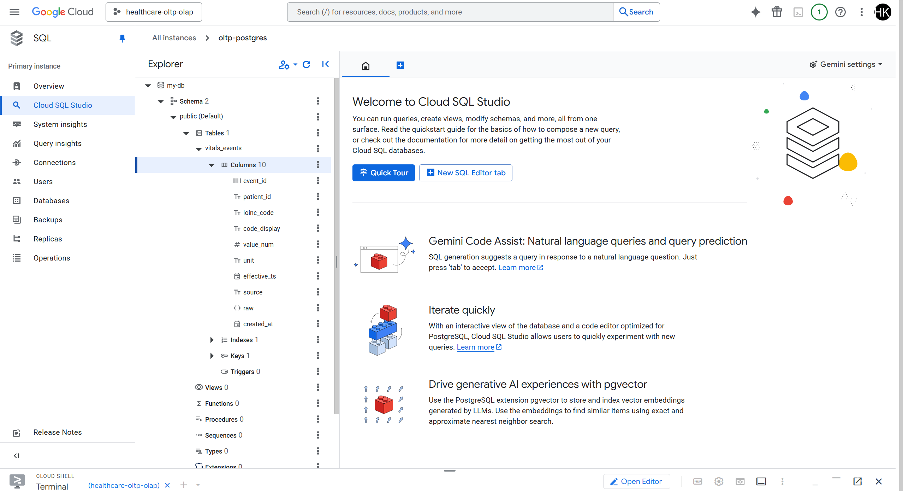

### Reasoning of Data:

I wanted this table to look like real clinical data, not a toy. In hospitals, vitals and labs are usually represented as FHIR Observations. FHIR stands for **Fast Healthcare Interoperability Resources**. It is a standard for exchanging healthcare data as JSON over REST.

I kept the shape of the OLTP Data FHIR-like and generated it myself. I used a small FastAPI app that inserts random heart rate observations every minute. The random part is just the value and which demo patient gets it; the structure and semantics match a real FHIR Observation.

Here’s how my OLTP schema lines up with FHIR fields:

- `event_id` = Observation.id (a globally unique identifier). I use a UUID so I can deduplicate safely in BigQuery when batch windows overlap.
- `patient_id` = Observation.subject.reference (the “Patient/P001” part). I store just P001 etc. for simplicity.
- `loinc_code` = Observation.code.coding[0].code (e.g., 8867-4).
- `code_display` = Observation.code.coding[0].display (“Heart rate”).
- `value_num` = Observation.valueQuantity.value (the number).
- `unit` = Observation.valueQuantity.unit (e.g., “beats/min”). The unit’s UCUM representation is what you’d standardize on later if you add more vitals.
- `effective_ts` = Observation.effectiveDateTime (when the measurement happened).
- `source` is my stamp that says “synthetic” so it’s obvious this is generated data.
- `raw` is a stringified JSON blob where I could stash the original FHIR JSON if I wanted to. For this project I kept it minimal to avoid arguing with parsers.
- `created_at` is the load time. This is handy for dedup rules (“keep the newest copy if two loads bring the same event_id”).

If I were to switch to real FHIR later, I wouldn’t change the warehouse design. I would replace the generator with **Cloud Healthcare API FHIR store in GCP**, push Observations into it, then stream/batch out to BigQuery.


## Data Generation (Cloud Run + FastAPI):

I chose FastAPI with one endpoint that inserts a single random heart rate record into Postgres each time it is called.
The following files are created within the GCP Cloud Code Editor, similar to to VSCode.

### Endpoint

`fastapi-ingest/_endpoint.py`
```code
from fastapi import FastAPI
import os, json, uuid, random
import psycopg2

app = FastAPI()

DB_USER = os.environ["DB_USER"]
DB_PASS = os.environ["DB_PASS"]
DB_NAME = os.environ["DB_NAME"]
DB_HOST = "/cloudsql/" + os.environ["INSTANCE_CONNECTION_NAME"]

SQL_QUERY = """
INSERT INTO public.vitals_events (
  event_id, patient_id, loinc_code, code_display,
  value_num, unit, effective_ts, source, raw
) VALUES (%s,%s,%s,%s,%s,%s,NOW(),%s,%s)
"""

def insert_row():
    with psycopg2.connect(user=DB_USER, password=DB_PASS, dbname=DB_NAME, host=DB_HOST) as conn:
        with conn.cursor() as cur:
            cur.execute(
                SQL_QUERY,
                (
                    str(uuid.uuid4()),
                    random.choice(["P001","P002","P003"]),
                    "8867-4",
                    "Heart rate",
                    round(random.uniform(60,100), 1),
                    "beats/min",
                    "synthetic",
                    json.dumps({"note": "fastapi demo"}),
                ),
            )

@app.get("/")
def health():
    return {"status": "ok"}

@app.post("/ingest")
def ingest():
    insert_row()
    return {"result": "inserted"}
```

`fastapi-ingest/requirements.txt`
```code
fastapi==0.111.0
uvicorn==0.30.1
psycopg2-binary==2.9.9
```

`fastapi-ingest/Dockerfile`
```code
FROM python:3.11-slim
WORKDIR /app
COPY requirements.txt .
RUN pip install --no-cache-dir -r requirements.txt
COPY _endpoint.py .
ENV PORT=8080
CMD ["uvicorn", "_endpoint:app", "--host", "0.0.0.0", "--port", "8080"]
```

After setting up this file structure in the editor, open the Cloud Shell Terminal to run the following command in order to build the image:

```code
cd fastapi-ingest
gcloud builds submit . --tag us-central1-docker.pkg.dev/healthcare-oltp-olap/app/fastapi-ingest:v1
```

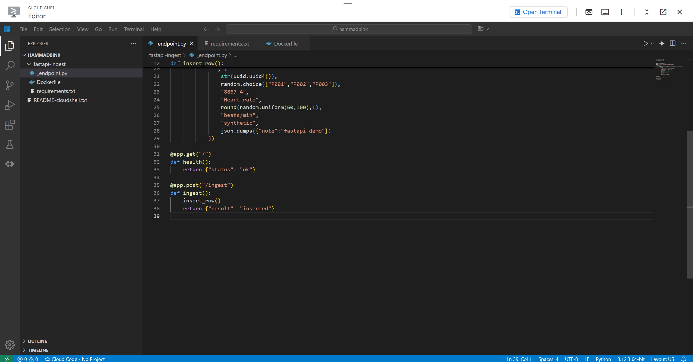

### Service Deployment:

Using the pushed image, I deployed the built image as a service named fastapi-ingest and wired it to Cloud SQL via the Unix socket.
In order to do this, I navigated to **Cloud Run** in GCP, and started with **Create Job** under **Jobs** from the left navigation bar.

I selected: 
- **Container image URL:** `us-central1-docker.pkg.dev/healthcare-oltp-olap/app/fastapi-ingest:v1` that I pushed previously.
- **Job Name:** `fastapi-ingest`
- **Region:** `us-central1 (Iowa)`
- **Connections --> Cloud SQL Connection:** `healthcare-oltp-olap:us-central1:oltp-postgres`
- **Environment Variables:** `As in Screenshot`

Note: I also navigated to **IAM & Admin --> IAM** section of GCP to assign the `Cloud SQL Client` role to the `Service Account` that is using the newly created Cloud Run Service `fastapi-ingest`.

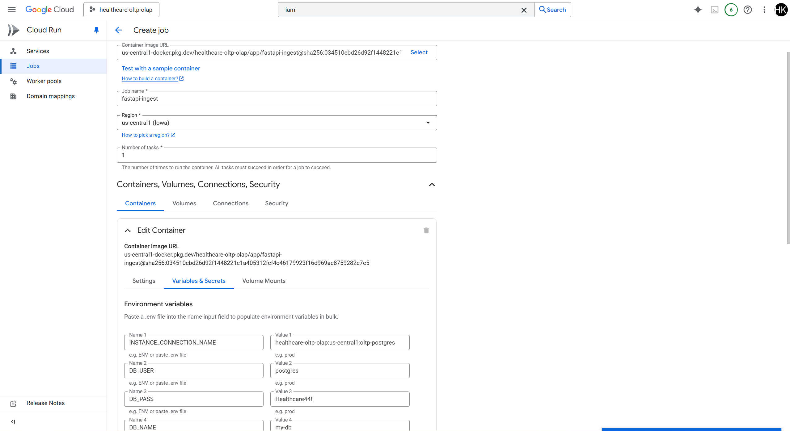


### Single Ingestion Test:

I tried a sample ingestion using the random ingestion endpoint using this Cloud Run Service using:

```code
curl -X POST -H "Authorization: Bearer $(gcloud auth print-identity-token)" \
  https://fastapi-ingest-32112765044.us-central1.run.app/ingest
```

### Automatic Ingestion (every minute):

One POST proved the service works. Next I need a steady drip of vitals into OLTP. For this, I used GCP's **Cloud Scheduler** call the existing service's `/ingest` endpoint constantly.

For this, I navigate to the GCP's **Cloud Scheduler** and **Create Job** with the following information:

- **Name**: `healthcare-vitals-ingest-every-minute`
- **Region:** `us-central1 (Iowa)`
- **Frequency:** `* * * * * (every minute)`
- **Timezone:** `Turkey`
- **Target Type & URL:** `HTTP` `https://fastapi-ingest-32112765044.us-central1.run.app/ingest` 
- **Auth Header & Service Account:** `OIDC` `{my_service_account}`

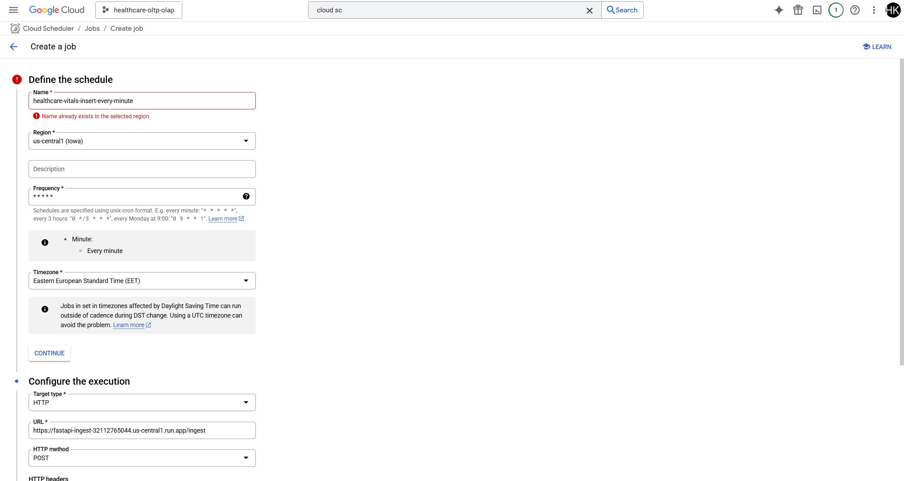


When this Scheduler Job starts running, it can be seen from the logs that the `/ingest` endpoint is being hit every minute, as can see in the screenshot:


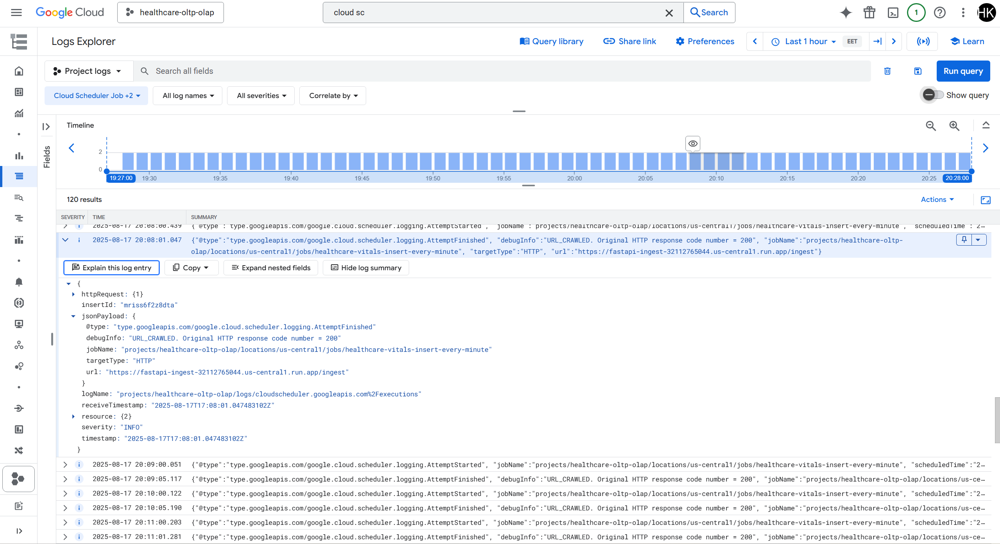


## Creating the OLAP Dataset (BigQuery) with Scheduling:

Now that the OLTP side is producing rows every minute, I need a landing zone in the warehouse. I created a dataset in GCP's **BigQuery** that will hold the raw replicated table and all of the analytics tables I’ll build on top. Dataset ID: `healthcare_analytics`. For the first run I do it manually (to prove it works), and then I automate it every 15 minutes.

### Staging Bucket for Dataflow

Since I will be using GCP's **Dataflow** as a "pipe" that periodically moves the OLTP ingested rows to BigQuery, it needs a scratch space for staging code and temporary files. For this purpose I used GCP's **Cloud Storage Buckets**, and I set them up as follows:

- **Staging location:** `gs://healthcare-oltp-olap-raw/dataflow/staging`
- **Temp location:** `gs://healthcare-oltp-olap-raw/dataflow/temp`

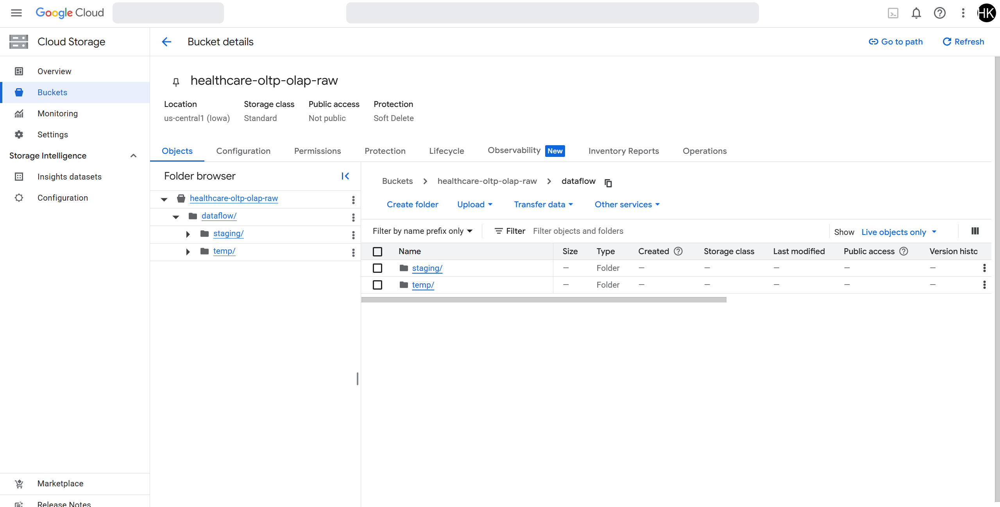


### Manually Create 1 Dataflow Job:

A **Dataflow Job** is a managed data pipeline that reads from one place, optionally transforms the data, and writes to another place. Under the hood it spins up workers for me, parallelizes the work, handles retries, and then shuts everything down when the job finishes. In this project I use a Flex Template called `PosgreSQL to BigQuery` so I don’t have to write any pipeline code. I have to tell it the following things:

- How to connect to Postgres (via the Cloud SQL socket).
- Which SQL to run (with a time window, so it’s a batch).
- Which BigQuery table to write to.
- Where to keep temporary files in GCS.

I will Create a Job and run it one time first, and then schedule it every 10 minutes so OLAP keeps up with the OLTP.
I navigate to GCP's **Dataflow** Jobs and `Create Job From Template`. This job I created with the following parameters:

- **Job name:** `pb2bq-initial-load`
- **Dataflow Template:** `PosgreSQL to BigQuery`
- **JDBC Connection URL String:** `jdbc:postgresql://google/my-db?cloudSqlInstance=healthcare-oltp-olap:us-central1:oltp-postgres&socketFactory=com.google.cloud.sql.postgres.SocketFactory`
- **Username:** `postgres`
- **Password:** `********`
- **BigQuery Output Table:** `healthcare-oltp-olap.healthcare_analytics.vitals_raw`
- **Temp location:** `gs://healthcare-oltp-olap-raw/dataflow/temp`
- **Staging location:** `gs://healthcare-oltp-olap-raw/dataflow/staging`
- **JDBC Source SQL Query:** `SELECT event_id, patient_id, loinc_code, code_display, value_num, unit, effective_ts, source, raw::text AS raw, created_at FROM public.vitals_events WHERE effective_ts >= NOW() - INTERVAL '20 minutes'`

After clicking **Run Job**, I see from the UI whether the job has succeeded or not:

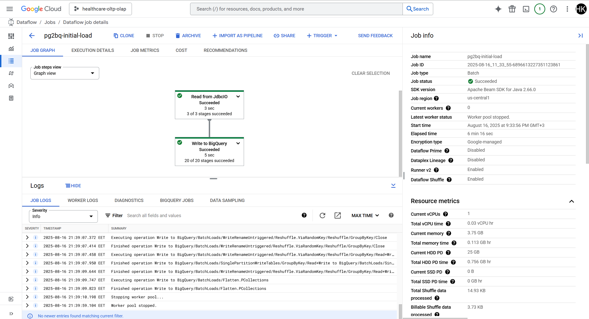

In order to further verify the success of the initial load, I run the following query in BigQuery and see if there is a row count:

```code
SELECT
  COUNT(*) AS row_count,
  MAX(effective_ts) AS latest_effective
FROM `healthcare-oltp-olap.healthcare_analytics.vitals_raw`;
```


### Schedule Dataflow Jobs (every 10 minutes):

Now that the one-time Dataflow run proved the pipeline works, I automated the same launch call with GCP's **Cloud Scheduler**, same where I setup the scheduler for a job hitting the `/ingest` endpoint every minute. Each run copies the last 20 minutes of Postgres data into BigQuery. With a 10-minute cadence, that creates a 10-minute overlap, so if a run is late or fails, the next run still picks up those rows. I de-duplicate in the warehouse later.

Similar to the previous time, I navigate to the GCP's **Cloud Scheduler** and **Create Job** with the following information:

- **Name**: `replicate-oltp-to-bq-10min`
- **Region:** `us-central1 (Iowa)`
- **Frequency:** `*/10 * * * * (every 10 minutes)`
- **Timezone:** `Turkey`
- **Target Type & URL:** `HTTP` `https://dataflow.googleapis.com/v1b3/projects/healthcare-oltp-olap/locations/us-central1/flexTemplates:launch` 
- **Auth Header & Service Account:** `OAuth` `{my_service_account}`
- **HTTP Method:** `POST`
- **HTTP Headers:** `Name1:``Content-Type` `Value1:``application/json`, `Name2:``User-Agent` `Value2:``Google-Cloud-Scheduler`
- **Body(`scheduler/dataflow_flex_body.json`):**
```code
{
  "launchParameter": {
    "jobName": "pg2bq-10min",
    "containerSpecGcsPath": "gs://dataflow-templates-us-central1/latest/flex/PostgreSQL_to_BigQuery",
    "parameters": {
      "connectionURL": "jdbc:postgresql://google/my-db?cloudSqlInstance=healthcare-oltp-olap:us-central1:oltp-postgres&socketFactory=com.google.cloud.sql.postgres.SocketFactory",
      "username": "postgres",
      "password": "********",
      "query": "SELECT event_id, patient_id, loinc_code, code_display, value_num, unit, effective_ts, source, raw::text AS raw, created_at FROM public.vitals_events WHERE effective_ts >= NOW() - INTERVAL '10 minutes'",
      "outputTable": "healthcare-oltp-olap:healthcare_analytics.vitals_raw",
      "bigQueryLoadingTemporaryDirectory": "gs://healthcare-oltp-olap-raw/dataflow/bqtemp"
    },
    "environment": {
      "stagingLocation": "gs://healthcare-oltp-olap-raw/dataflow/staging",
      "tempLocation": "gs://healthcare-oltp-olap-raw/dataflow/temp",
      "serviceAccountEmail": "32112765044-compute@developer.gserviceaccount.com"
    }
  }
}

```

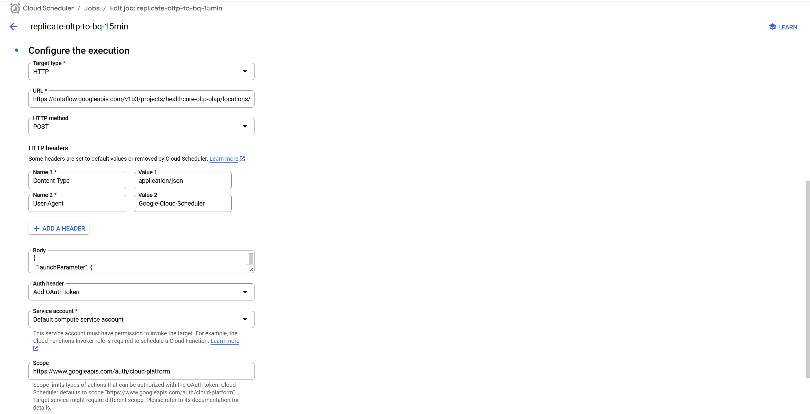


After I submit this Scheduler Job, I can confirm from the Dataflow UI that a new Dataflow Job is being created and **Success** every 10 minutes.


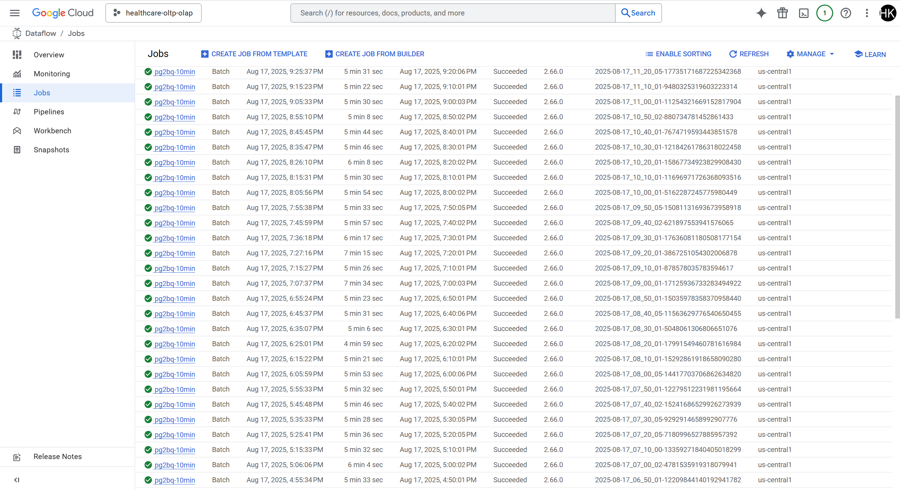


## Analytics Model Design (Star Schema):

Once the raw rows are landing in BigQuery every 10 minutes, I shift to making the data easy to analyze. That’s where the **Star Schema** comes in. It contains one central fact table with numbers and foreign keys, surrounded by small dimension tables with human-readable labels. The reason I chose Star Schema is:
- So I can easily analyze queries for joining Facts to a few small lookups.
- It’s faster and cheaper in BigQuery with well partitioned and clustered Fact.
- It’s robust to batch overlap so I can de-duplicate events once in the Fact and keep the rest of the model clean.

### How I Mapped my Data to a Star:

- **Fact:** Each heart rate observation (one row per `event_id`) with numeric `value_num` and `effective_ts`.
- **Dimensions:** 
  - **Time:** One row per calendar day. Gives year/quarter/month/weekday/weekend without rewriting date functions.
  - **Patient:** Stable patient_key (hash of patient_id) plus first/last seen and a simple count, for easy patient filters.
  - **Code:** LOINC code and display text (e.g., 8867-4, “Heart rate”).
  - **Unit:** beats/min today.
  - **Source:** Lineage like "synthetic".


### Mapping from OLTP to Star:

| OLTP column    | Star location (final)                                                                     |
| -------------- | ----------------------------------------------------------------------------------------- |
| `event_id`     | `fact_vitals_star.event_id` (degenerate ID kept for traceability)                         |
| `patient_id`   | `dim_patient.patient_id` becomes `fact_vitals_star.patient_key`                           |
| `loinc_code`   | `dim_code.loinc_code` becomes `fact_vitals_star.code_key`                                 |
| `value_num`    | `fact_vitals_star.measure_value`                                                          |
| `unit`         | `dim_unit.unit` becomes `fact_vitals_star.unit_key`                                       |
| `effective_ts` | `fact_vitals_star.effective_ts` and `fact_vitals_star.date_key` (for joins to `dim_time`) |
| `source`       | `dim_source.source` becomes `fact_vitals_star.source_key`                                 |
| `created_at`   | used only in **`fact_vitals`** to deduplicate overlapping loads                           |
| `raw`          | kept only in **`fact_vitals`** for audit/debug (not in star)                              |


### Star Model (Mermaid Renderer): 

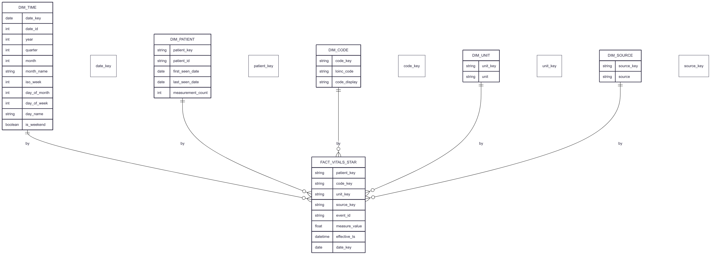


### Building the Model Tables:

#### FACT Table:

This is the clean, deduplicated copy of my raw feed data. My Dataflow job runs every 10 minutes but looks back 20 minutes, so the **same event_id can be copied twice**. The following query basically says that for each `event_id`, we are sorting by `created_at` newest first, and keep only row number 1.” That gives me one clean row per measurement while preserving the original raw columns for debugging.

`sql/bq_fact_vitals.sql`
```code
CREATE OR REPLACE TABLE `healthcare-oltp-olap.healthcare_analytics.fact_vitals` AS
SELECT
  event_id,
  patient_id,
  loinc_code,
  code_display,
  value_num,
  unit,
  effective_ts,
  source,
  created_at,
  raw
FROM `healthcare-oltp-olap.healthcare_analytics.vitals_raw`
QUALIFY ROW_NUMBER() OVER (
  PARTITION BY event_id
  ORDER BY created_at DESC
) = 1;
```

#### DIMENSIONS Tables:

##### Time dimension (calendar helper):

This generates one row per calendar day between the first and last measurement. It precomputes year, month, weekday, etc., so I don’t rewrite date math in every report. Then I'll join on `date_key` later.

`sql/bq_dim_time.sql`
```
CREATE OR REPLACE TABLE `healthcare-oltp-olap.healthcare_analytics.dim_time` AS
SELECT
  date_key,
  CAST(FORMAT_DATE('%Y%m%d', date_key) AS INT64) AS date_id,
  EXTRACT(YEAR FROM date_key) AS year,
  EXTRACT(QUARTER FROM date_key) AS quarter,
  EXTRACT(MONTH FROM date_key) AS month,
  FORMAT_DATE('%B', date_key) AS month_name,
  EXTRACT(ISOWEEK FROM date_key) AS iso_week,
  EXTRACT(DAY FROM date_key) AS day_of_month,
  EXTRACT(DAYOFWEEK FROM date_key) AS day_of_week,
  FORMAT_DATE('%A', date_key) AS day_name,
  IF(EXTRACT(DAYOFWEEK FROM date_key) IN (1,7), TRUE, FALSE) AS is_weekend
FROM UNNEST(
  GENERATE_DATE_ARRAY(
    (SELECT DATE(MIN(effective_ts)) FROM `healthcare-oltp-olap.healthcare_analytics.fact_vitals`),
    (SELECT DATE(MAX(effective_ts)) FROM `healthcare-oltp-olap.healthcare_analytics.fact_vitals`)
  )
) AS date_key;
```


##### Patient dimension:

This generates one row per patient with a stable surrogate key (`patient_key` = hash of `patient_id`) and a few useful summaries (first/last seen, count). The star fact will store `patient_key` instead of the raw `patient_id`.

`sql/bq_dim_patient.sql`
```
CREATE OR REPLACE TABLE `healthcare-oltp-olap.healthcare_analytics.dim_patient` AS
SELECT
  TO_HEX(SHA256(patient_id)) AS patient_key,
  patient_id,
  MIN(DATE(effective_ts)) AS first_seen_date,
  MAX(DATE(effective_ts)) AS last_seen_date,
  COUNT(*) AS measurement_count
FROM `healthcare-oltp-olap.healthcare_analytics.fact_vitals`
GROUP BY patient_id;
```


##### Code dimension:

This maps LOINC codes to readable labels and gives each code a key (`code_key`). `ANY_VALUE` is fine here because each code has one label in this dataset.

`sql/bq_dim_code.sql`
```
CREATE OR REPLACE TABLE `healthcare-oltp-olap.healthcare_analytics.dim_code` AS
SELECT
  TO_HEX(SHA256(loinc_code)) AS code_key,
  loinc_code,
  ANY_VALUE(code_display) AS code_display
FROM `healthcare-oltp-olap.healthcare_analytics.fact_vitals`
GROUP BY loinc_code;
```


##### Unit dimension:

This is just a tiny lookup so the star fact can store a small unit_key and so I could still show the text “beats/min”.

`sql/bq_dim_unit.sql`
```
CREATE OR REPLACE TABLE `healthcare-oltp-olap.healthcare_analytics.dim_unit` AS
SELECT
  TO_HEX(SHA256(unit)) AS unit_key,
  unit
FROM (
  SELECT DISTINCT unit
  FROM `healthcare-oltp-olap.healthcare_analytics.fact_vitals`
);
```


##### Source dimension:

This lets me filter by where the data came from (e.g., `synthetic` for this project) without carrying long text in the fact.

`sql/bq_dim_source.sql`
```
CREATE OR REPLACE TABLE `healthcare-oltp-olap.healthcare_analytics.dim_source` AS
SELECT
  TO_HEX(SHA256(source)) AS source_key,
  source
FROM (
  SELECT DISTINCT source
  FROM `healthcare-oltp-olap.healthcare_analytics.fact_vitals`
);
```


#### STAR FACT (Partitioned-Clustered):

This is the analytics table. It stores **keys** (`patient_key`, `code_key`, `unit_key`, `source_key`), the **numeric measure** (`measure_value`), the **event_id** (kept as a degenerate identifier for traceability), and **timestamps**.

For the Partitioning, with the following query one partition is created per day, so that the queries that filter by date scan fewer bytes. For Clustering, rows with similar keys (for `patient_key` and `code_key`) are stored together, so using this, filters and joins on on these keys are faster.

`sql/bq_fact_vitals_star.sql`
```
CREATE OR REPLACE TABLE `healthcare-oltp-olap.healthcare_analytics.fact_vitals_star`
PARTITION BY DATE(effective_ts)
CLUSTER BY patient_key, code_key AS
SELECT
  `healthcare-oltp-olap.healthcare_analytics.dim_patient`.patient_key,
  `healthcare-oltp-olap.healthcare_analytics.dim_code`.code_key,
  `healthcare-oltp-olap.healthcare_analytics.dim_unit`.unit_key,
  `healthcare-oltp-olap.healthcare_analytics.dim_source`.source_key,
  DATE(`healthcare-oltp-olap.healthcare_analytics.fact_vitals`.effective_ts) AS date_key,
  `healthcare-oltp-olap.healthcare_analytics.fact_vitals`.event_id,
  `healthcare-oltp-olap.healthcare_analytics.fact_vitals`.value_num AS measure_value,
  `healthcare-oltp-olap.healthcare_analytics.fact_vitals`.effective_ts
FROM `healthcare-oltp-olap.healthcare_analytics.fact_vitals`
JOIN `healthcare-oltp-olap.healthcare_analytics.dim_patient` USING (patient_id)
JOIN `healthcare-oltp-olap.healthcare_analytics.dim_code`    USING (loinc_code)
JOIN `healthcare-oltp-olap.healthcare_analytics.dim_unit`    USING (unit)
JOIN `healthcare-oltp-olap.healthcare_analytics.dim_source`  USING (source);
```


#### Sanity Checks:

After each build I ran quick checks to be confident I didn’t introduce mistakes.

##### Counts Match:

These should be equal. If not, I likely lost rows in a join.

```code
SELECT
  (SELECT COUNT(*) FROM `healthcare-oltp-olap.healthcare_analytics.fact_vitals`) AS fact_rows,
  (SELECT COUNT(*) FROM `healthcare-oltp-olap.healthcare_analytics.fact_vitals_star`) AS star_rows;
```

##### No Missing Dimensions:

Should return 0. If not, a join key mismatched.

```code
SELECT COUNT(*) AS rows_missing_any_dimension
FROM `healthcare-oltp-olap.healthcare_analytics`.fact_vitals
LEFT JOIN `healthcare-oltp-olap.healthcare_analytics`.dim_patient
  ON `healthcare-oltp-olap.healthcare_analytics`.dim_patient.patient_id =
     `healthcare-oltp-olap.healthcare_analytics`.fact_vitals.patient_id
LEFT JOIN `healthcare-oltp-olap.healthcare_analytics`.dim_code
  ON `healthcare-oltp-olap.healthcare_analytics`.dim_code.loinc_code =
     `healthcare-oltp-olap.healthcare_analytics`.fact_vitals.loinc_code
LEFT JOIN `healthcare-oltp-olap.healthcare_analytics`.dim_unit
  ON `healthcare-oltp-olap.healthcare_analytics`.dim_unit.unit =
     `healthcare-oltp-olap.healthcare_analytics`.fact_vitals.unit
LEFT JOIN `healthcare-oltp-olap.healthcare_analytics`.dim_source
  ON `healthcare-oltp-olap.healthcare_analytics`.dim_source.source =
     `healthcare-oltp-olap.healthcare_analytics`.fact_vitals.source
WHERE `healthcare-oltp-olap.healthcare_analytics`.dim_patient.patient_key IS NULL
   OR `healthcare-oltp-olap.healthcare_analytics`.dim_code.code_key IS NULL
   OR `healthcare-oltp-olap.healthcare_analytics`.dim_unit.unit_key IS NULL
   OR `healthcare-oltp-olap.healthcare_analytics`.dim_source.source_key IS NULL;
```

##### Partitions are Populated:

Confirms partition-by-day is in effect and has rows.

```code
SELECT partition_id, total_rows
FROM `healthcare-oltp-olap.healthcare_analytics`.INFORMATION_SCHEMA.PARTITIONS
WHERE table_name = 'fact_vitals_star'
ORDER BY partition_id DESC;
```


### Schedule Model to Refresh:

Once all the tables have been created, I schedule all of them to refresh. Here by "Refresh" I mean **re-materializing** the analytics tables on a cadence so they always reflect the latest rows that landed in `vitals_raw`. So it does the following:

- `fact_vitals` is rebuilt from `vitals_raw` with a deterministic dedup rule (keep the newest `created_at` per `event_id`). This is idempotent, i.e. if the same source rows arrive again (because the Dataflow window overlaps), running the script again doesn’t create duplicates.
- `dim_*` tables are re-derived from `fact_vitals`. They’re tiny and cheap to compute, so rebuilding keeps them in sync with whatever the fact currently contains.
- `fact_vitals_star` is rebuilt after the dimensions so it can pick up the latest `*_key` values. The star keeps the numeric measure (`measure_value`), the foreign keys, `event_id` for traceability, and is **partitioned by day and clustered by common filters**.

This is a batch-first design, so the OLTP to OLAP copy is already batched (every 10 minutes with a 20-minute lookback), so the model follows suit. Every refresh is a clean snapshot of the truth at that moment.


#### Scheduling

For scheduling these scripts, GCP's Scheduler that was used twice previously isn't needed here, these will be scheduled directly inside the BigQuery.

Each script can be scheduled from inside them by clicking on the `Schedule` icon inside each query, and naming as .e.g. `build_dim_time_hourly`. It would be as follows:

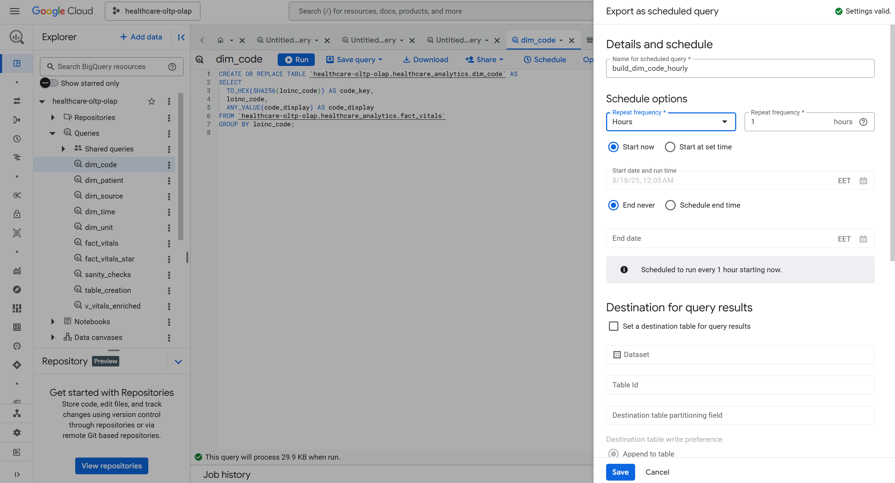

Ideally it should be in order such that it builds: `fact_vitals` --> `all dim_*` --> `fact_vitals_star`. What I did was `build_fact_vitals_15min`, `build_dim_time_hourly`, and `build_fact_vitals_star_hourly`.

From the left navigation bar in BigQuery, **Scheduling** can be selected and it would show all the scheduled queries and their previous failed/success runs as follows:

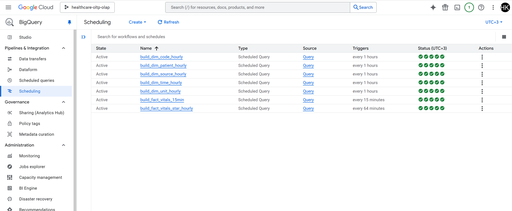


## Replication Process Monitoring:

### Views in BigQuery:

There are several ways to monitor while on GCP, by accessing the logs for every component through UI, but I need to create a custom replication process monitoring system, where it can be seen last runs of the replication process, success/failure, etc. So for this case I will first export **Cloud Scheduler executions** and **Dataflow job messages** into **BigQuery** so I can query them.

I created a new dataset named `monitoring` in my BigQuery. Secondly, I created a new sink by navigating to GCP's **Logging --> Log Router** with follows:

- **Sink Name:** `to-bq-monitoring`
- **Sink Destination:** `healthcare-oltp-olap.monitoring`
- **Build Inclusion Filter:**
```code
(
  logName = "projects/healthcare-oltp-olap/logs/cloudscheduler.googleapis.com%2Fexecutions"
)
OR
(
  logName = "projects/healthcare-oltp-olap/logs/dataflow.googleapis.com%2Fjob-message"
)
```

After creating this logging sink, after a few minutes, tables `cloudscheduler_` and `dataflow_` are inserted to the `healthcare-oltp-olap.monitoring` dataset.


To monitor the OLTP to OLAP replication, I created a view in the `monitoring` dataset:

- **Scheduler Executions View** (`scheduler_executions_results_vw`): This filters Cloud Scheduler logs to only real attempts (those with HTTP status codes). Each row represents one completed run, with job name, timestamp, status code, and a success flag (is_success = TRUE if HTTP 2xx). With this, I can answer the following question: Did my ingestion jobs run and succeed? (`Scheduler View`)

From this `Scheduler View`, I further derive the following views:

- Latest status per job
- Daily summary per job
- 7-day summary per job
- Failures (latest first)

#### Base View (Scheduler View):

Pulls the last 7 days of execution logs, extracts HTTP status, computes a success flag (2xx).

```code
CREATE OR REPLACE VIEW `healthcare-oltp-olap.monitoring.scheduler_executions_results_vw` AS
SELECT
  timestamp,
  resource.labels.job_id AS job_name,
  SAFE_CAST(httpRequest.status AS INT64) AS http_status,
  SAFE_CAST(httpRequest.status AS INT64) BETWEEN 200 AND 299 AS is_success,
  httpRequest.requestUrl AS target_url,
  severity,
  _TABLE_SUFFIX AS day_partition
FROM `healthcare-oltp-olap.monitoring.cloudscheduler_googleapis_com_executions_*`
WHERE _TABLE_SUFFIX >= FORMAT_DATE('%Y%m%d', DATE_SUB(CURRENT_DATE(), INTERVAL 7 DAY))
  AND SAFE_CAST(httpRequest.status AS INT64) IS NOT NULL
ORDER BY timestamp DESC;
```

#### Latest Status per Job

For each job, return only its most recent execution.

```code
CREATE OR REPLACE VIEW `healthcare-oltp-olap.monitoring.scheduler_executions_last_status_vw` AS
SELECT
  timestamp AS last_event_ts,
  job_name,
  http_status AS last_http_status,
  is_success AS last_is_success,
  target_url AS last_target_url,
  severity AS last_severity
FROM `healthcare-oltp-olap.monitoring.scheduler_executions_results_vw`
QUALIFY ROW_NUMBER() OVER (PARTITION BY job_name ORDER BY timestamp DESC) = 1
ORDER BY last_event_ts DESC;
```

#### Daily Summary per Job

For each job, return only its most recent execution.

```code
CREATE OR REPLACE VIEW `healthcare-oltp-olap.monitoring.scheduler_executions_daily_summary_vw` AS
SELECT
  DATE(timestamp) AS event_date,
  job_name,
  COUNT(*) AS total_runs,
  SUM(CASE WHEN is_success THEN 1 ELSE 0 END) AS success_runs,
  SUM(CASE WHEN NOT is_success THEN 1 ELSE 0 END) AS failed_runs,
  SAFE_DIVIDE(SUM(CASE WHEN is_success THEN 1 ELSE 0 END), COUNT(*)) AS success_rate
FROM `healthcare-oltp-olap.monitoring.scheduler_executions_results_vw`
GROUP BY event_date, job_name
ORDER BY event_date DESC, job_name;
```


#### 7-Day Summary per Job

A roll-up of the last 7 days (since the base view already limits to 7 days).

```code
CREATE OR REPLACE VIEW `healthcare-oltp-olap.monitoring.scheduler_executions_7d_summary_vw` AS
SELECT
  job_name,
  COUNT(*) AS runs_7d,
  SUM(CASE WHEN is_success THEN 1 ELSE 0 END) AS success_7d,
  SAFE_DIVIDE(SUM(CASE WHEN is_success THEN 1 ELSE 0 END), COUNT(*)) AS success_rate_7d
FROM `healthcare-oltp-olap.monitoring.scheduler_executions_results_vw`
GROUP BY job_name
ORDER BY success_rate_7d DESC, runs_7d DESC;
```


#### Failures (Latest First)

A roll-up of the last 7 days (since the base view already limits to 7 days).

```code
CREATE OR REPLACE VIEW `healthcare-oltp-olap.monitoring.scheduler_executions_errors_vw` AS
SELECT
  timestamp,
  job_name,
  http_status,
  target_url,
  severity
FROM `healthcare-oltp-olap.monitoring.scheduler_executions_results_vw`
WHERE NOT is_success
ORDER BY timestamp DESC;
```


### Views Hooked to Looker Studio:

I connected the BigQuery views into a Looker Studio report and created 4 simple visualizations. These are for future reference since right now the data is very little and has just most 1-2 days worth of running data. (https://lookerstudio.google.com/reporting/19bfe035-262d-46c4-ae5b-670fa359935e)

- **Current Health (Table):** Shows each job’s last run, with HTTP status, success/failure, and timestamp.
- **Trends (Time Series):** Daily success rate % over time (per job).
- **Trends (Table):** Last 7 days, showing total runs, successes, and success rate % per job.
- **Failures (Table):** List of recent failed executions with timestamp, job name, HTTP status, and target URL for quick investigation.


## Conclusion:

This project proves that it’s possible to stand up a fully working OLTP to OLAP pipeline on Google Cloud Platform (GCP) with a small but realistic design. I started from a simple operational Postgres table, ingested data continuously, replicated into BigQuery on a safe cadence, modeled it into a star schema, and added monitoring + dashboards for visibility.

While the system is intentionally small, it shows the essential building blocks: ingestion, replication, transformation, and monitoring. From here it could be extended with richer FHIR data, additional dimensions, or production-grade alerting.